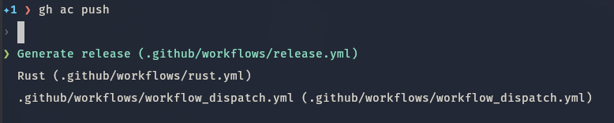
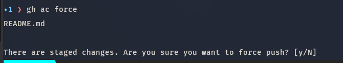

# Gh actions

Trigger Github action runs, and open the action run in the browser.

## Installation

```bash
gh extension install https://github.com/shawnyu5/gh-ac
```

> **Note** Since rust binaries are dymically linked. Sometimes the precompiled binary will not work on your system. In the case, you must clone the repo and run `./script/build.sh && gh extension install .` to compile and install the extension locally

## Usage

- `gh ac push` - push unpushed commits if there are any. Allow the user to select the workflow run to fetch, and open the latest workflow run in the browser.



- `gh ac force` - get the most recent workflow for current repo. Perform a `git commit --amend --no-edit && git push --force` on the current branch. Allow the user to select the workflow run to fetch, and open the latest workflow run in the browser.
  - if there are currently staged changes, prompt for confirmation before proceeding



- `gh ac dispatch` - create a workflow dispatch event to trigger a manual workflow
  - `gh ac dispatch --ref <branch_name>` to select the branch to dispatch the workflow from. Defaults to the current branch
  - input can be passed to the workflow in the form `gh ac dispatch -d key=val -d key2=val2`
- `gh ac <push|force|dispatch> -w <WORKFLOW_NAME>` - specify the workflow name to search for. This is not case sensitive.
- `gh ac <push|force|dispatch> --url` - print out the workflow URL instead of opening it in browser
- `gh ac config --hostname` to get a custom hostname (for Github enterprise)
- `gh ac <command> -v` - configure logging level. More time the flag is specified, the more granular the logging
- `gh ac cleanup` - cleanup old workflows in the Github actions tab, whose workflow files has been renamed, or deleted. Old workflows are identified by workflows that has the same name as the path to the workflow file.
  - This is no longer an issue in the Public Github. Workflows are automatically removed once their action files are deleted. This is still an issue in GHE.
  - For example, a workflow called `.github/workflows/ci.yml`, whose path is `.github/workflows/ci.yml` will be considered an old workflow, which will be cleaned up.

## Full help

```
fire off github actions and open the lastest action run in browser

Usage: gh-ac [OPTIONS] <COMMAND>

Commands:
  push      push all unpushed commits
  force     force push to trigger new workflow run(s)
  dispatch  create a workflow dispatch event
  config    set configuration values
  help      Print this message or the help of the given subcommand(s)

Options:
  -v, --verbosity...
  -h, --help          Print help
  -V, --version       Print version
```
